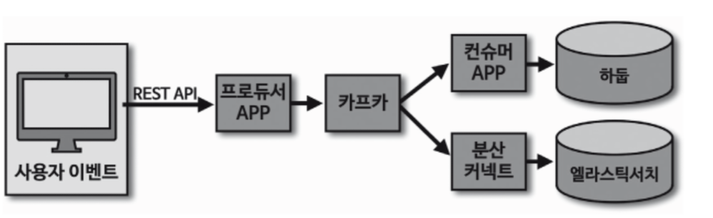

# kafka 미니프로젝트

### ❓요구사항

- 이름을 입력하고 자신이 좋아하는 색생을 고르는 버튼을 누르면 해당 이벤트와 유저 에이전트 정보를 카프카 토픽으로 전달하고 최종적으로 하둡과 엘라스틱 서치에 저장하는 것을 목표로 한다.
- 하둡은 대용량 데이터를 분석 처리 할 수 있다. 
- HDFS는 대용량 파일을 하둡에 안정적으로 저장할 수 있게 하는 파일 시스템이다.
- 엘라스틱서치는 아파치 루씬 기반 오픈소스 분산 검색 엔진 , 엘라스틱서치에 데이터를 쌓아서 방대한 양의 데이터를 저장, 검색 ,분석할 수 있다. 사용자의 이벤트를 엘라스틱서치에 쌓아서 키바나를 통해 데이터를 시각화하고 분석할 수 있다.

### 🚨 파이프라인 정책
- 일부 데이터의 유실 또는 중복 허용
- 안정적으로 끊임없는 적재
- 갑작스럽게 발생하는 많은 데이터양을 허용

---

### 아키텍처


- 로컬 하둡 , 엘라스틱서치 , 키바나 설치
- 토픽생성
- 이벤트 수집 웹페이지 개발
- REST API 프로듀서 애플리케이션 개발
- 하둡 적재 컨슈머 애플리케이션 개발
- 엘라스틱서치 싱크 커넥터 개발

### 프로듀서
- ack - 일부 유실이나 중복이 발생하더라도 안정적이고 빠른 파이프라인을 구성하기 위해 **1로 설정**
- min.insync.replicas - acks를 1로 선택했기 때문에 설정(replicas) 무시하고 리더 파티션에 지속 적재하게 된다.
- partition - **기본 파티셔너** ( UniformStickyPartitioner )
- retries(재시도) - **기본값**
- 압축 옵션 :   
총 용량을 줄이고 네트워크의 사용량을 줄이는 효과가 있지만 , CPU와 메모리 사용량이 늘어남. 따라서 압축을 하지않았을 때보다 처리량이 줄어들 수 있다. **기본값**

### 토픽
- partition 갯수 :    
데이터 처리 순서를 지켜야 하는지 여부에 따라 엄격하게 정할지 말지 결정한다. 데이터를 순서대로 적재하지 않더라도 하둡과 엘라스틱서치에서 데이터를 조회할 때 시간 순서대로 조회할 수 있다.
이벤트가 발생할 때 이벤트 발생 시간을 데이터에 같이 조합해서 보내 처리순서를 지키지 않아도 된다. 따라서 **파티션의 개수는 2개**
- 메시지 키의 사용여부 :  
메시지 키를 사용하고 커스텀 프로듀서 파티셔너를 사용하지 않을 경우 메시지 키의 해시값으로 파티션이 분배되기 떄문이다.  
추후 파티션이 증가되면 해시값과 파티션의 매칭이 깨지기 때문에 메시지 키를 활용하고 특정파티션에 할당하는 컨슈머를 운영할 경우 매우 곤란해진다.  
메시지 키를 사용하지 않으므로 토픽에 들어오는 **데이터의 양에 따라 파티션 개수를 가변적으로 설정한다.**
- 복제 개수 : 높을 수록 데이터의 복구 확률이 높아진다. 다만 복제 개수가 너무 높으면 팔로워 파티션이 데이터를 복사하는 데에 시간이 오래걸리며 용량 또한 늘어난다.  
따라서 1대에 이슈가 발생했을 경우에도 안정적으로 데이터를 받기 위해 **최소 설정으로 2로 설정**

### 컨슈머
- 토픽에 저장되어있는 웹 이벤트를 하둡과 엘라스틱서치에 저장하는 로직을 만드는 방법은 크게 두가지 방법이 있다.

> 첫번째 방법은 컨슈머 API를 사용하여 직접 애플리케이션을 개발하는 방법   
> 두번째 방법은 커넥트를 사용하는 것 , 분산커넥트를 사용하면 REST API를 통해 커넥터로 반복적인 파이프라인을 쉽게 생성할 수 있다.

### 기능 구현 


- 로컬 하둡 엘라스틱서치 키바나 설치
- brew 설치(키바나 엘라스틱서치) 안되는 이슈 있는듯 2023/11/22일
- docker로 대체 예정

```zsh
  brew tap elastic/tap
  brew install elastic/tap/kibana-full
  brew install elastic/tap/elasticsearch-full
  brew install hadoop 
```

- 토픽생성 
```zsh
bin/kafka-topics.sh --create \
--bootstrap-server host:9092 \
--replication-factor 2 \
--partitions 3 \
--topic select-color
```
싱글 카프카 브로커일 경우 replication-factor 1 로 지정해도 실습 무관함


참고 :  아파치 카프카 애플리케이션 프로그래밍 with 자바 